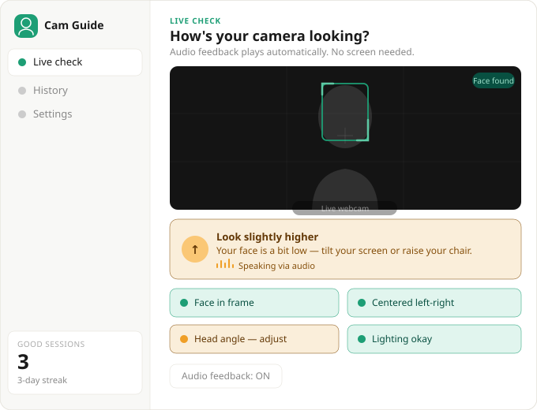

# Cam Guide

**Webcam position assistant for blind and low-vision users on video calls.**

Tells you — via audio — whether your face is centered, well-lit, and properly framed, so you can join video calls confidently without needing to see the screen.

---

## How it works

Open one HTML file in your browser. That's it. No install, no server, no account.

The app uses your webcam to detect your face and speaks feedback out loud through your speakers or headphones. It tells you exactly what to adjust — "Move slightly right", "You're too close", "Look a little higher" — and goes quiet when everything looks good.

---

## Quick start

1. Download `cam-guide-working.html`
2. Open it in **Chrome** or **Edge** (recommended)
3. Click **Start camera**
4. Allow webcam access when the browser asks
5. Listen to the audio feedback and adjust your position

When you hear **"You look great, you are ready for your call"** — you're good to go.

---

## What it checks

| Check | What it detects | Audio example |
|---|---|---|
| Face in frame | Whether your face is visible at all | "Face not detected. Position yourself in front of the camera." |
| Left-right centering | Whether your face is centered horizontally | "Move slightly right" |
| Vertical position | Whether your face is too high or too low | "Look slightly higher or raise your screen" |
| Head tilt | Whether your head is level | "Straighten your head — it's tilted" |
| Distance | Whether you're too close or too far | "Move back — you're too close" |
| Lighting | Whether the room is too dark or too bright | "Too dark — turn on a light facing you" |

---

## Controls

| Control | What it does |
|---|---|
| Start camera | Begins webcam + audio feedback |
| Audio feedback: ON/OFF | Mutes or unmutes spoken alerts |

Audio repeats at most once every 4 seconds per message — no spam.

---

## Accessibility notes

- **Primary output is audio** — no screen reading required
- All key elements have ARIA labels and `aria-live` regions
- Works with screen readers (NVDA, VoiceOver, JAWS)
- Mute button has `aria-pressed` state
- Camera preview is intentionally low-opacity — the visual is for sighted observers, not the user

---

## Browser compatibility

| Browser | Status |
|---|---|
| Chrome | ✅ Recommended |
| Edge | ✅ Supported |
| Firefox | ⚠️ MediaPipe issues — not recommended |
| Safari | ⚠️ Not tested |

Requires: webcam access permission, speakers or headphones.

---

## How it's built

Everything runs in the browser. No data leaves your device.

| Component | Technology |
|---|---|
| Face detection | [MediaPipe FaceMesh](https://google.github.io/mediapipe/solutions/face_mesh) — 468 facial landmarks, WASM, runs locally |
| Audio feedback | [Web Speech API](https://developer.mozilla.org/en-US/docs/Web/API/SpeechSynthesis) — `SpeechSynthesisUtterance` |
| Lighting check | Canvas pixel brightness sampling (every 2 seconds) |
| No backend | Fully offline after first load |

### Detection logic

- **Centering**: nose X position vs frame center (threshold ±12%)
- **Vertical position**: face center Y vs ideal 42% from top
- **Head tilt**: eye-line angle via `Math.atan2` on left/right eye landmarks
- **Distance**: face bounding box width as proxy (ideal: 15%–65% of frame width)
- **Lighting**: average pixel luminance across a 64×48 canvas sample (ideal: 40–220)

---

## Use case

Designed for **blind and low-vision freelancers** joining video calls with sighted clients. Getting camera position right is difficult without visual feedback — this app solves that with audio alone.

Also useful for anyone who wants a quick "am I on camera correctly?" check before a call.

---

## Files

| File | Description |
|---|---|
| `cam-guide-working.html` | The working app — open this in Chrome |
| `cam-guide-mockup.html` | Static UI mockup (no webcam) |
| `cam-guide-ui.svg` | UI preview image (shown above) |
| `README.md` | This file |

---

## Privacy

- No video is recorded or transmitted
- All processing runs locally in your browser (WASM)
- Camera access is only used while the page is open

---

## Credits

Built with [MediaPipe](https://google.github.io/mediapipe/) by Google and the [Web Speech API](https://developer.mozilla.org/en-US/docs/Web/API/Web_Speech_API).

Inspired by [Posture Sensei](https://github.com/Kiara-03-Lab/posture-detection) — a gamified posture monitor built by Kiara Lab.
